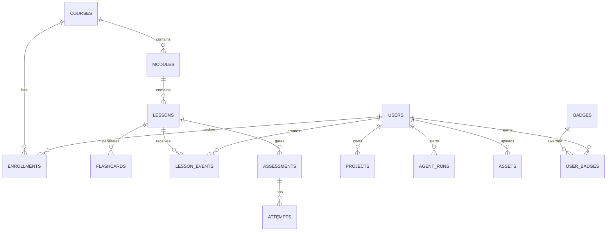

# LearnVerse AI — production architecture

## Product surface
The current Next.js surface is the student command center: overview, learning paths, AI mentor, campus zones, project queue, achievements, momentum, bilingual toggle, and action feedback. It is intentionally backed by domain-shaped data so each card can be replaced by a server query without changing the UI.

## Monorepo shape
```text
learnverse/
├─ apps/web/                  # Next.js 15 App Router, R3F campus, shadcn components
│  ├─ app/(auth)/             # sign-in, onboarding, locale selection
│  ├─ app/(student)/          # dashboard, paths, lesson, projects, achievements
│  ├─ app/admin/              # users, content, moderation, agent runs, analytics
│  ├─ components/             # design system + domain components
│  └─ lib/api.ts              # typed fetch client, Clerk session token
├─ services/api/              # FastAPI: REST, WebSocket, background jobs
│  ├─ app/api/v1/             # auth, users, learning, content, agents, research
│  ├─ app/domain/             # entities, policies, assessment rules
│  ├─ app/workers/            # ingestion, video, research, exports
│  └─ tests/
├─ packages/contracts/        # OpenAPI generated TypeScript + Pydantic schemas
├─ packages/agents/           # LangGraph graphs and CrewAI crews
├─ infra/                     # docker-compose, Terraform, Kubernetes, CI
└─ docs/
```

## PostgreSQL schema / ER design
Core tables: `users(id, clerk_id, locale, role, level, xp, streak)`, `skills(id, slug, parent_id)`, `courses(id, title, source, difficulty)`, `modules(id, course_id, sort_order)`, `lessons(id, module_id, content, locale)`, `enrollments(user_id, course_id, progress)`, `lesson_events(user_id, lesson_id, score, retention_score)`, `assessments(id, lesson_id, tier, passing_score)`, `attempts(user_id, assessment_id, score)`, `projects(id, owner_id, brief, status)`, `assets(id, owner_id, kind, storage_key, checksum)`, `agent_runs(id, user_id, agent, status, trace_id)`, `flashcards(id, lesson_id, front, back, locale)`, `badges(id, slug)`, `user_badges(user_id,badge_id,earned_at)`, `research_items(id, source_url, type, freshness, embedding_id)`.



## API architecture
`GET /api/v1/me`, `GET /courses?skill=`, `POST /enrollments`, `GET /paths/{id}`, `POST /lessons/{id}/events`, `POST /assessments/{id}/attempts`, `POST /uploads/presign`, `POST /ingest`, `POST /agents/{agent}/runs`, `GET /agents/runs/{id}`, `POST /research/query`, `GET /recommendations`, and `WS /api/v1/streams/{run_id}`. Clerk JWT middleware establishes identity; RBAC guards admin routes. All mutation endpoints use idempotency keys and Pydantic validation.

## Agent system
A LangGraph supervisor routes to Teacher, Study Assistant, Coding Assistant, Research, Video Understanding, Project Replication, Career Coach, and Mentor nodes. Each graph has `intake → retrieve → reason → tool calls → verify → persist → stream`. CrewAI is used for the multi-agent research crew. Tools are allow-listed (search, Qdrant retrieval, sandboxed code runner, document parser) and all traces go to OpenTelemetry. Human review is required before publishing generated curriculum.

## Import pipeline
S3 presigned upload → MIME/type scan → extraction (Markdown/PDF/PPTX/DOCX/ASR) → normalized blocks → chunk + metadata → Qdrant embeddings → curriculum graph generation → quiz/project/flashcard generation → moderation queue → publish. Every generated artifact stores source block IDs for citations and deletion propagation.

## Assessment and adaptive learning
Beginner content is practice-first. Intermediate requires a quiz; advanced requires assessment; expert requires verified project evidence. A recommendation worker combines skill mastery, recent events, retention, pace, language, and goals. Weak areas get retrieval practice and spaced repetition; strong areas unlock project quests.

## Deployment
Local Docker Compose: web, api, worker, postgres, redis, qdrant, minio. Production: Vercel or containerized web behind CDN; FastAPI on Kubernetes; managed Postgres with PgBouncer; Redis Streams; Qdrant cluster; S3; OpenTelemetry + Grafana. CI runs typecheck, unit/integration tests, migration check, dependency scan, image scan, and preview deploy. Secrets are injected from a cloud secret manager, never committed.

## Delivery plan
**MVP:** auth/onboarding, markdown/PDF import, course/path generation, student dashboard, teacher + study assistant, quizzes, XP/streaks, Tamil/English, basic admin moderation.

**Production:** video intelligence, coding sandbox, R3F campus, research watchlists, adaptive mastery, exports to PDF/PPT, notifications, audit logs, prompt/version registry, eval harness.

**Enterprise:** organization tenancy, SCIM/SSO, custom curricula, private model gateway, data residency, per-tenant Qdrant collections, approval workflows, SLA observability, cost budgets, and fine-grained policy controls.
